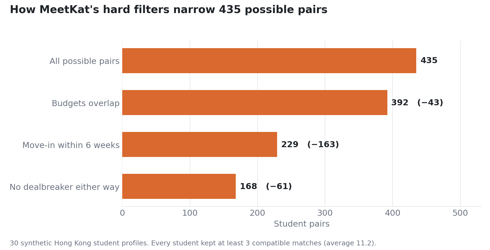

# MeetKat

An AI flatmate-matching prototype for university students in Hong Kong, where
non-local enrolment has outgrown campus housing roughly three to one.

MeetKat started as a four-person venture pitch (portfolio case study:
[haydenfong.framer.website/work/meetkat](https://haydenfong.framer.website/work/meetkat)).
This repo is the part I built afterwards to test the riskiest product assumption:
can software match flatmates well from what students write about themselves?

## Results so far (synthetic data)

Tested on 30 synthetic Hong Kong student profiles, written from known traits.
These check the system, not user satisfaction.

| What | Result |
|---|---|
| LLM trait extraction (Gemini 3.5 Flash-Lite) | 176 of 180 traits correct (97.8%) |
| Hard filters | 435 possible pairs narrowed to 168; every student kept at least 3 matches |
| Planted test cases | 7 of 7 handled correctly, including a hidden lifestyle clash form-only matching missed |
| Automated tests | 55 passing |

All four extraction misses came from the model guessing when the text was
ambiguous; the next prompt version would tell it to answer "unknown" instead.
What this does not show yet is that students prefer the AI's matches. The blind
test in step 5 below is built for that and has not been run with real students.



## How it works

1. **Intake.** A Google Form collects tick-box answers (budget, move-in month,
   sleep schedule, tidiness, dealbreakers) and one free-text answer.
   `make_google_form.py` generates the form from `config.py`, so labels always match the code.
2. **Extraction** (`parse_profiles.py`). An LLM turns the free text into fixed labels:
   social energy, study habits, weekend lifestyle, and habits or dealbreakers the form
   doesn't ask about. Replies are forced to a JSON schema, validated, retried once, and cached.
3. **Matching** (`matcher.py`). Hard filters drop pairs that fail on budget, move-in
   timing or a dealbreaker, checked both ways. Each remaining pair gets two directional
   scores (how well B suits A, and A suits B), combined with a harmonic mean so a match
   only scores well if it works for both. A heap picks each student's top matches.
4. **Blind test** (`build_experiment.py`). Each student sees three unlabelled matches:
   two from AI matching and one from form-only matching, each a pick the other method
   didn't rank in its top three. Picking only where the methods disagree fixes a bias
   in my first design, where the form-only pick was usually a leftover.
5. **Rating app** (`app.py`, Streamlit) and **analysis** (`analyze.py`, paired
   permutation test with a bootstrap confidence interval).

| Step | Complexity |
|---|---|
| Filters and scoring per pair | O(1) |
| Building the graph | O(n²) |
| Top-k per student with a size-k heap | O(d log k) |

## Run it

No API key needed for the offline path:

```bash
python generate_test_data.py                   # 30 synthetic students
python parse_profiles.py --sample --offline    # uses the known traits instead of the LLM
python matcher.py --sample
python system_report.py --sample               # filter funnel and mode comparison
python build_experiment.py --sample --offline
MEETKAT_SAMPLE=1 streamlit run app.py          # log in with a code from sample_data/test_access_codes.csv
python -m unittest -v
```

With a key, drop `--offline`: `export GEMINI_API_KEY=...` (Google) or
`export ANTHROPIC_API_KEY=...` (Claude), then `python evaluate_extraction.py`
scores the extraction. `python parse_profiles.py --show-prompt` prints the exact prompt.

Everything in `data/` would be real student data and is gitignored. Files marked
SIMULATED or SYNTHETIC are generated, not collected. All weights and thresholds are in `config.py`.
